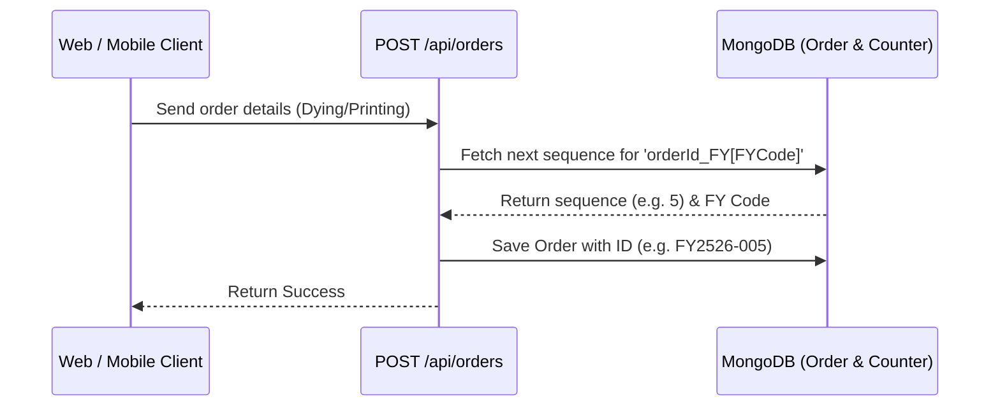
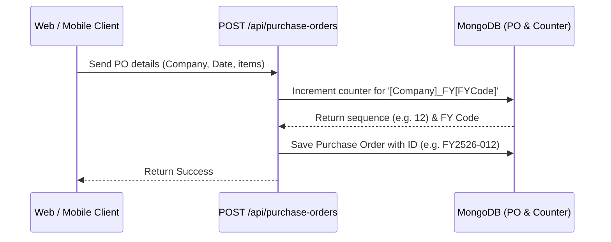

# Financial Year (FY) Sequence Auto-Changing Specification

This specification explains how the automated Financial Year calculation, automatic resets, and sequence generation operate consistently and securely across both the **Web Client** and **Mobile Application** (iOS & Android).

---

## 1. Core Logic: The Indian Financial Year (IST)

In India, the financial year starts on **April 1st** and ends on **March 31st** of the subsequent calendar year. 

The calculation is implemented on the backend in [models/Counter.ts](file:///home/krish/Downloads/ViralFabrics-main/models/Counter.ts) within the `getCurrentFinancialYear(date)` function:

```typescript
export function getCurrentFinancialYear(date?: Date): string {
  let now = date;

  if (!now) {
    // Offset local/server time to IST (UTC+5:30)
    // This is CRITICAL because FY transitions happen at Midnight IST, but servers are in UTC.
    const utcDate = new Date();
    const utcTime = utcDate.getTime() + (utcDate.getTimezoneOffset() * 60000);
    const istOffset = 5.5 * 60 * 60 * 1000;
    now = new Date(utcTime + istOffset);
  }

  const month = now.getMonth(); // 0-indexed (0=Jan, 3=Apr)
  const year = now.getFullYear();

  // If month >= April (3), FY starts this year
  // If month < April, FY started last year
  const fyStartYear = month >= 3 ? year : year - 1;
  const fyEndYear = fyStartYear + 1;

  const startCode = String(fyStartYear).slice(-2);
  const endCode = String(fyEndYear).slice(-2);

  return `${startCode}${endCode}`; // Returns e.g. "2526"
}
```

### Critical Security Highlights:
- **Server-Side Truth**: All final ID and sequence generation is calculated on the server. There is **zero risk** of client-side clock tampering or timezone offsets affecting the database.
- **IST Timezone Offset**: Because transitions happen at exactly Midnight IST, the system offsets the server time to IST (UTC+5:30) when no date is provided. This prevents the next year's counter from starting early or late due to server timezone configurations.

---

## 2. Auto-Reset Counter Scoping

The MongoDB counters collections use a scoped key pattern:
`[base_key]_FY[fyCode]` (e.g. `orderId_FY2526` or `po_viral_fabrics_FY2526`).

When a transaction is made, the database runs `findByIdAndUpdate` with `$inc: { sequence: 1 }` and `upsert: true`.
- On **March 31st**: The calculated key is `po_viral_fabrics_FY2425`. The sequence increments.
- On **April 1st**: The calculated key automatically becomes `po_viral_fabrics_FY2526`. Since this document does not exist yet, MongoDB performs an `upsert` (insert), initializing the sequence at `1`.
- **Result**: The counter resets to `001` automatically. No crons, timers, or manual databases intervention are required.

---

## 3. Web and Mobile Flow Comparisons

Since the mobile app and website use the exact same REST API endpoints, the logic behaves **100% identically** on both platforms:

### A. Sales Orders (Dying / Printing)
- **Generation**: Triggered only upon creation.
- **Backend Model**: Handled by the Mongoose pre-save hook inside [models/Order.ts](file:///home/krish/Downloads/ViralFabrics-main/models/Order.ts).
- **Update Behavior**: Once generated, the Sales Order ID (`orderId`) is locked and permanent. It does not change if the date is edited, ensuring permanent audit integrity.



### B. Purchase Orders (Viral Fabrics / Viral Enterprise)
- **Interactive Preview**: When creating a PO, both the web and mobile interfaces query:
  `/api/purchase-orders/next-number?companyHeader=...&poDate=...`
  This returns a preview of the next available PO number for the selected company and date.
- **Generation**: Triggered on creation. Scoped by Company Header (`po_viral_fabrics` or `po_viral_enterprise`) and selected `poDate`.
- **Update Behavior**: Handled in [app/api/purchase-orders/[id]/route.ts](file:///home/krish/Downloads/ViralFabrics-main/app/api/purchase-orders/[id]/route.ts). If the user edits the PO and changes the date to a different Financial Year, or switches the Company Header, the server automatically regenerates the `poNumber` under the new scope's sequence.



---

## 4. Conclusion: 100% Confidence Matrix

| Module | Web Client | Mobile Application (iOS/Android) | Mechanics | Risk / Conflict |
| :--- | :--- | :--- | :--- | :--- |
| **Sales Orders** | ✅ Supported | ✅ Supported | Backend-only creation hook in Mongoose model | **None** (Server-side generated, locked on update) |
| **Purchase Orders** | ✅ Supported | ✅ Supported | API-based preview + backend-enforced increments | **None** (Auto-regenerates PO ID if date shifts FY) |

Both channels operate on the same database and code guidelines, ensuring **100% compatibility, reliability, and security**.
