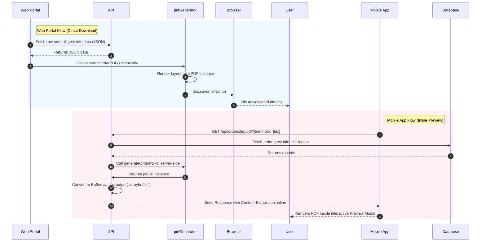

# Fabric Purchase Order (PO) PDF & Item View Guide

This comprehensive guide explains the architecture, layout, technical workflow, and rendering mechanisms for the **Fabric Purchase Order (PO) PDF** and the **Order Item Views** across the ViralFabrics web portal and mobile application.

---

## 1. File Structure & Architectural Overview

The order PDF generation and item rendering features are spread across both the frontend and backend of the Next.js web application, as well as the React Native mobile app:

```
ViralFabrics/
├── lib/
│   └── pdfGenerator.ts             # Core PDF generation library (client & server-safe)
├── app/
│   ├── (pages)/
│   │   └── (dashboard)/
│   │       └── orders/
│   │           ├── OrdersClient.tsx # Orders List Page (triggers client-side PDF download)
│   │           └── orderdetails/
│   │               └── page.tsx     # Order Details Page (renders detailed item views)
│   └── api/
│       └── orders/
│           └── [id]/
│               └── pdf/
│                   └── route.ts     # Server-side API endpoint for PDF generation (with inline preview)
└── mobile-app/
    └── app/
        └── (tabs)/
            └── orders.tsx           # Mobile App Orders Screen (previews PDF via API)
```

---

## 2. What is Inside the Purchase Order PDF?

The PDF sheet is designed as a highly structured, compact **Fabric Purchase Order Sheet** generated using **jsPDF**. It utilizes a manual, coordinate-based rendering layout to ensure pixel-perfect positioning.

Here is a breakdown of the visual layout and the data fields included in the PDF:

### Header Section (Financial Year & Metadata Row)
*   **Financial Year:** Positioned at the very top right (e.g., `FY 2627-001` parsed from the Order ID).
*   **A Bordered Header Row (4 Columns):**
    1.  **PARTY:** The buyer or party name associated with the order (rendered in blue `#002b59`).
    2.  **PO NO:** The Purchase Order number.
    3.  **PO DATE:** The date the PO was created (formatted as `DD/MM/YY`).
    4.  **DELIVERY DATE:** The requested delivery date.

### Left Box (Quality & Style Specifications)
A vertical stack of fields surrounded by a solid border:
*   **QUALITY:** The name of the fabric quality (e.g., *Cotton*, *Satin*).
*   **FINISH Qty:** The target finished meters.
*   **GREY QTY:** The total grey meters calculated dynamically from the Grey Information entries.
*   **A Bordered Spec Group containing:**
    *   **CUTTING:** Field for manual notes.
    *   **STYLE:** The style number/code.
    *   **DESIGN / CD Number:** Fabric design reference.

### Right Box (Purchase Details & Grey Information Table)
*   **PURCHASE Title:** Centered label at the top.
*   **WEAVER:** The weaver/supplier name.
*   **ORDER QTY & RATE:** Combined row displaying the purchase order quantity and the raw purchase rate.
*   **Grey Information Table:** A dynamic table mapping grey fabric deliveries. It shows:
    *   **DATE:** Delivery date.
    *   **CH NO:** Chalan (delivery challan) number.
    *   **TAKA:** Number of pieces (Taka).
    *   **MTR:** Meters delivered.
    *   *Note: Shows a minimum of 5 rows (padded with empty rows if there are fewer entries) to maintain visual consistency.*
*   **TOTAL:** Horizontal summary row showing the sum of TAKA (pieces) and MTR (meters).
*   **GREY REPORT:** A bordered box at the bottom of the table with space for manual notes.

### Bottom Table (Process Tracking & Accounting)
A large, multi-column table spanning the width of the page to track the fabric's lifecycle:
*   **ISSUE TO MILL:** Tracks the date, chalan number, pieces, and meters issued to the mill, as well as the Mill Name.
*   **REC FROM MILL:** Tracks finished meters received back from the mill, along with the **Mill Rate**.
*   **SALES:** Tracks dispatches (Date, Bill No, Finished Meters) and the **Sales Rate**.
*   **ORDER ID:** Positioned in a bordered section at the very bottom right, showing only the sequence number of the order.

---

## 3. Web UI: How the Item View is Shown

Order items (qualities) are represented in two key pages in the web application:

### A. The Orders List Page (`OrdersClient.tsx`)
In the main orders table, each order can contain multiple items. They are rendered as sub-rows or list items:
*   **Desktop View:** Items are displayed in a nested table within the order row, showing columns for **Quality Name**, **Quantity**, **Weaver**, and **Images**. On the right, an **Actions column** contains a button labeled **"PDF"** with a download icon.
*   **Mobile View:** Items are rendered as card elements. Under the quality name, a small button group contains a circular blue button with a `DocumentArrowDownIcon` labeled **"PDF"**.
*   *Note: The PDF button is hidden for standard users (`!isUser` check) and is only accessible to admins/masters.*

### B. The Order Details Page (`orderdetails/page.tsx`)
When a user clicks on an order to view its full details, they see the **"Items & Lab Data"** section:
*   Each item is rendered inside a card with a subtle shadow and hover effect.
*   It displays the **Quality Name**, **Weaver**, **Current Process Badge** (e.g., *In Dyeing*, *Finish*, *Ready to Dispatch* - dynamically computed based on highest priority process in the mill inputs), and the **Order Quantity**.
*   **Rates Grid:** Displays three distinct colored badges showing:
    *   **Purchase Rate:** (Green, e.g., `₹120.00`)
    *   **Mill Rate:** (Sky Blue, e.g., `₹15.00`)
    *   **Sales Rate:** (Violet, e.g., `₹145.00`)
*   **Lab Data:** If lab testing has been initiated, it shows the Lab status, Sample Number, Color, Shade, and Lab images.
*   *Note: There is currently no PDF download button directly on the Order Details page; the PDF buttons are located exclusively on the main Orders List page.*

---

## 4. Why Does Clicking "PDF" Download Instead of Previewing?

The difference in behavior between downloading and previewing is a result of **where the PDF is generated** and **how the browser is instructed to handle the output**.



### The Web Portal Flow (Direct Download)
When you click the "PDF" button on the website:
1.  The browser fetches the raw JSON data for the order and grey info from the API.
2.  It runs `generateOrderPDF(itemOrder)` **completely client-side** in the user's browser.
3.  Inside `lib/pdfGenerator.ts`, at the end of the generator function:
    ```typescript
    // Download the PDF
    const fileName = `FABRIC_PURCHASE_ORDER_SHEET_${(order.orderId || '').toUpperCase()}_...pdf`;
    if (typeof window !== 'undefined') {
      doc.save(fileName); // <--- THIS FORCES AN IMMEDIATE DOWNLOAD
    }
    ```
    The `doc.save()` method in jsPDF triggers a browser download prompt immediately. It never gives the browser a chance to display it inline.

### The Server-Side API & Mobile Flow (Inline Preview)
In contrast, the mobile app uses a server-side API route at `GET /api/orders/[id]/pdf`:
1.  The server fetches the database records and generates the PDF on the backend.
2.  It converts the PDF to a buffer: `const pdfBuffer = Buffer.from(doc.output("arraybuffer"))`.
3.  It returns the PDF with the following headers:
    ```typescript
    return new Response(pdfBuffer, {
      status: 200,
      headers: {
        "Content-Type": "application/pdf",
        "Content-Disposition": `inline; filename="${filename}"`, // <--- "inline" instructs browser to preview
        "Content-Length": pdfBuffer.length.toString()
      }
    });
    ```
4.  Because the header specifies **`Content-Disposition: inline`**, the browser (or mobile webview) is instructed to **preview/render** the PDF directly in the window instead of downloading it.

---

## 5. How to Enable PDF Previewing in the Web Portal

If you want the web portal to preview the PDF instead of downloading it directly, there are two ways this can be implemented:

### Option A: Open the Server-Side Preview API in a New Tab (Easiest & Cleanest)
Instead of generating the PDF client-side, we can direct the browser to open the existing server-side API route in a new tab. Since the API uses `Content-Disposition: inline`, the browser will render a full-page PDF preview with its native controls (print, save, zoom).

Modify `handleDownloadItemPDF` in `app/(pages)/(dashboard)/orders/OrdersClient.tsx`:

```typescript
  const handleDownloadItemPDF = useCallback(async (order: any, item: any, itemIndex: number) => {
    try {
      const token = localStorage.getItem('token');
      // Construct the API URL targeting the server-side PDF endpoint
      const pdfUrl = `/api/orders/${order._id}/pdf?itemIndex=${itemIndex}${token ? `&token=${token}` : ''}`;
      
      // Open in a new tab to let the browser's native PDF viewer render it inline
      window.open(pdfUrl, '_blank');
      
      showMessage('success', `Opening PDF Preview for ${item.quality?.name || 'Item'}`, {
        autoDismiss: true,
        dismissTime: 2000
      });
    } catch (error: any) {
      console.error('PDF preview error:', error);
    }
  }, [showMessage]);
```

### Option B: Modify the Client-Side Generator to Open a Blob URL
If you prefer to keep the PDF generation client-side (saving server bandwidth), you can modify the client-side generator to output a `Blob` and open it in a new window rather than calling `doc.save()`.

In `lib/pdfGenerator.ts`, you could split or parameterize the output method:

```typescript
// Instead of doc.save(fileName)
const pdfBlob = doc.output('blob');
const blobURL = URL.createObjectURL(pdfBlob);
window.open(blobURL, '_blank');
```

---

## Summary Table of PDF & Item View Locations

| Feature / UI Element | Files Involved | Key Technologies | Behavior |
| :--- | :--- | :--- | :--- |
| **PO PDF Layout / Fields** | [pdfGenerator.ts](file:///home/krish/Downloads/ViralFabrics-main/lib/pdfGenerator.ts) | `jsPDF`, `jspdf-autotable` | Handles grid coordinates, boxes, lines, and typography. |
| **Orders List PDF Button** | [OrdersClient.tsx](file:///home/krish/Downloads/ViralFabrics-main/app/(pages)/(dashboard)/orders/OrdersClient.tsx) | React/Next.js client | Client-side generation; triggers **direct download** via `doc.save()`. |
| **Server-side PDF API** | [route.ts](file:///home/krish/Downloads/ViralFabrics-main/app/api/orders/%5Bid%5D/pdf/route.ts) | Next.js API Routes, Mongoose | Generates PDF on server; returns stream with **inline preview** headers. |
| **Order Details Item Card** | [page.tsx](file:///home/krish/Downloads/ViralFabrics-main/app/(pages)/(dashboard)/orders/orderdetails/page.tsx) | Tailwind CSS, React components | Shows Quality, Weaver, Rates (Purchase, Mill, Sales), and Process Badge. |
| **Mobile PDF Preview** | [orders.tsx](file:///home/krish/Downloads/ViralFabrics-main/mobile-app/app/(tabs)/orders.tsx) | React Native, Expo `Linking` | Fetches from Server API; displays preview modal, opens in mobile browser. |
