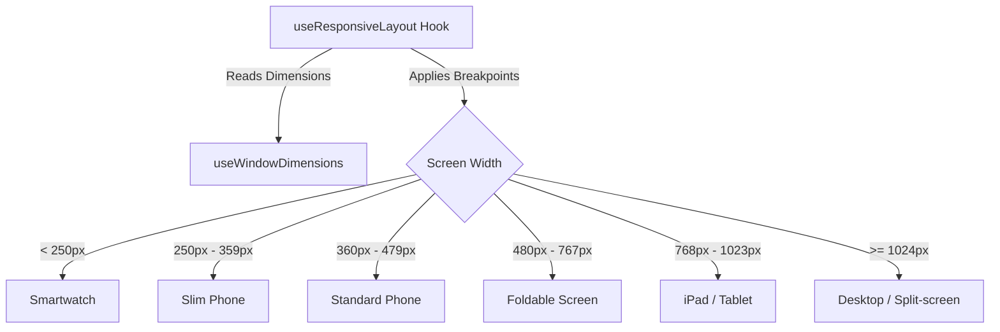

# iOS Device Compatibility, Real-Time Architecture & Manual Testing Guide

This comprehensive document serves as the guide for the **Viral Fabrics Mobile App** (React Native / Expo) regarding iOS device compatibility, adaptive layouts, background execution, gesture physics, offline caching, real-time WebSocket communication, and step-by-step manual testing.

---

## Part 1: Universal iOS Display & Device Support

The mobile application is designed to be fully responsive and stable across all iOS form factors (iPhones and iPads), display capabilities, and operating system versions.



### A. Breakpoints & Adaptive Grid System
Layout scaling and column density are calculated dynamically in JavaScript using the [`useResponsiveLayout`](file:///home/krish/Downloads/ViralFabrics-main/mobile-app/hooks/useResponsiveLayout.ts) hook. This hook listens to live changes in screen size and provides standard variables for styling:

*   **Breakpoints Matrix:**
    *   `isSmartWatch`: Screen width `< 250px`
    *   `isSlimPhone`: Screen width `[250px, 360px)`
    *   `isPhone`: Screen width `[360px, 480px)`
    *   `isFoldable`: Screen width `[480px, 768px)`
    *   `isTablet`: Screen width `[768px, 1024px)`
    *   `isDesktop`: Screen width `>= 1024px`
*   **Dynamic Grid Columns:**
    *   Single Column (`numColumns = 1`): Screen width `< 600px` (Portrait phones).
    *   Double Column (`numColumns = 2`): Screen width `[600px, 1280px)` (Tablets, landscape phones).
    *   Triple Column (`numColumns = 3`): Screen width `>= 1280px` (Ultra-wide iPads, external displays).
*   **Adaptive Component Sizing:**
    *   **Modals:** `modalMaxWidth` is capped at `700px` on tablets/desktops to prevent content stretching, but expands to `100%` on phones.
    *   **Root Container:** Content is centered and bounded at a maximum width of `1200px` on very large screens for optimal readability.

### B. Portrait & Landscape Orientation
*   **Dynamic Layout Reflow:** The app is configured with `"orientation": "portrait"` by default in `app.json` for phones, but iPad configurations override this to support all directions. 
*   **Safe Area Management:** By utilizing `useSafeAreaInsets()` from `react-native-safe-area-context`, layouts dynamically inject paddings at the edges. This prevents content, inputs, or navigation headers from clipping under:
    *   The Dynamic Island or Notch.
    *   The bottom Home Indicator bar.
    *   Left/right bezel margins when rotated into landscape orientation.

### C. iPad Multitasking (Split View & Slide Over)
*   Because layouts use `useWindowDimensions()` instead of one-time static calculations, the viewport measurements dynamically update when an iPad user resizes the application into a **Split View** half-screen or opens it inside a floating **Slide Over** panel.
*   The UI automatically swaps between the tablet layout (2 columns, centered modals) and the phone layout (1 column, full-screen modals) without requiring a reload or causing component crashes.

### D. 120Hz ProMotion Display Support
*   **Activation:** ProMotion displays (found on iPhone 13 Pro/Pro Max and newer, and iPad Pro models) are unlocked by setting `"CADisableMinimumFrameDurationOnPhone": true` inside the `ios.infoPlist` configuration of `app.json`.
*   **Result:** This tells iOS to run the application at the device’s maximum refresh rate (up to 120Hz/120fps) rather than forcing a 60Hz limit. Scrolling lists (like `@shopify/flash-list`) and layout transitions render with near-zero latency, reducing motion blur and rendering animations smoothly.

---

## Part 2: Technical Architecture & Core Features

```
+------------------------------------------------------------------------------------------------+
|                                      VIRAL FABRICS APP CLIENT                                  |
|                                                                                                |
|  +---------------------------+  +---------------------------+  +----------------------------+  |
|  |     OFFLINE CACHING       |  |       GESTURE SYSTEM      |  |      REAL-TIME ENGINE      |  |
|  |  * Interceptor (Axios)    |  |  * PanResponder physics   |  |  * Socket.io-client        |  |
|  |  * Async Storage backend  |  |  * Rubber-band (0.15x dy) |  |  * Fallback Polling        |  |
|  |  * Stale check (7 days)   |  |  * Drag-to-dismiss threshold|  |  * Invalidation trigger   |  |
|  +-------------+-------------+  +-------------+-------------+  +-------------+--------------+  |
+----------------|-----------------------------|-------------------------------|-----------------+
                 |                             |                               |
                 v                             v                               v
       Local AsyncStorage Cache       iOS Native Gesture Engine        WebSocket / HTTP Polling
```

### A. Gestures & One-Handed Usability
*   **One-Hand Reachability:** The app structures interactive buttons, action trigger zones, and tabs towards the bottom 60% of the screen. Users can comfortably operate major navigation flows with their thumbs without shifting their grip.
*   **Swipe-to-Close Sheet Physics:** Bottom sheets and modals use React Native's `PanResponder` API combined with Reanimated v3:
    *   **Header Touch Interception:** Touches inside the top `85px` drag handle are intercepted immediately by returning `true` on `onStartShouldSetPanResponder` to distinguish sheet drags from inner content scrolls.
    *   **Upward Resistance:** Dragging upward exerts a friction factor of `0.15` (e.g. `translateY = dragY * 0.15`), preventing the sheet from being dragged beyond its natural bounds.
    *   **Dismissal Threshold:** Release gestures trigger a close animation if:
        1.  The downward drag exceeds `80px`.
        2.  The downward velocity (`vy`) is faster than `0.3 px/ms` (quick flick).
    *   **Spring Restoring:** If the drag falls short of these thresholds, a customized spring animation (`tension: 40, friction: 9`) smoothly snaps the sheet back to the top.

### B. Cursor Flashing & Input Focus Handling
*   **autofocus:** Text inputs in forms use standard React Native autofocus properties, bringing up the virtual keyboard immediately upon navigation.
*   **Keyboard Avoidance:** Layouts wrap forms in a custom container to dynamically adjust screen offsets when the virtual keyboard rises, keeping the cursor visible and preventing it from being covered by the keyboard.
*   **Cursor Blinking:** The caret (cursor) flashes according to iOS native settings. Input states are isolated so that rapid cursor movement or text typing does not trigger heavy re-renders, avoiding input lag.

### C. Screen on Background (Background Execution)
*   **State Detection:** The app listens to the system [`AppState`](https://reactnative.dev/docs/appstate) API to capture when the application moves between:
    *   `active`: Running in the foreground.
    *   `background`: User minimized the app or locked the screen.
    *   `inactive`: App is in multitasking view or receiving a call.
*   **Background Actions:**
    *   Active network connections are kept alive briefly by the system.
    *   When backgrounded, socket listeners are suspended to preserve battery.
    *   Upon wake (`background` -> `active`), the app triggers background refetches via TanStack React Query to check if the session is still valid and fetch fresh data.

### D. Offline Support & Cache Architecture
Offline synchronization and caching are managed via a custom Axios interceptor system (`services/api.ts`):

1.  **Response Caching (GET Requests):**
    *   Every successful `GET` request yields a cache entry saved in AsyncStorage under a structured key:
        `api_cache:${baseURL}:${url}:${params}`
    *   Along with the data, a `timestamp` is saved to check cache freshness.
2.  **Offline Fallback:**
    *   When a request fails due to `Network Error` or `ERR_NETWORK`, the Axios response interceptor intercepts the failure.
    *   It checks the device's network state (synced to the global Zustand store `isOffline`).
    *   If offline, the interceptor searches AsyncStorage for a matching cache key.
    *   **Stale Cache Check:** If the cached response is less than **7 days old**, the interceptor resolves the request as if it succeeded, returning the cached data with an additional custom header `x-from-cache: true`. Cache older than 7 days is deleted to prevent stale data.
3.  **Write Invalidation (POST/PUT/DELETE):**
    *   When the user is online and triggers a mutation (creating, editing, or deleting a resource), the app clears the associated cache entries:
        *   An edit to `/api/orders/123` wipes all cache entries containing `:orders`.
        *   Sub-resource edits automatically cascade (e.g., updating order dispatch metrics clears both dispatch and main order caches).
    *   This forces the app to request fresh data from the server on the next visit.

### E. WebSockets & Real-Time Sync
*   **Server Setup:** The Next.js server (`server.js`) initializes a `socket.io` server mapped to `/api/socket.io`. It utilizes WebSocket connection transports, falling back to long-polling when firewalls or serverless limits block WebSockets.
*   **Logout Broadcast (`logout-all`):** When a user triggers a global logout, the server broadcasts a `logout_all` event immediately to all active socket connections.
*   **Client Listener:** The web client listens via `useSocketLogoutListener.ts`. The mobile client uses an HTTP-based fallback during API requests to check the `/api/auth/logout-all-status` endpoint. This guarantees security even if socket streams are dropped.

---

## Part 3: Manual Testing Guide for Testers

This section details step-by-step test cases for testers to manually verify device layout, gesture, background, and connectivity behaviors.

---

### Test Category 1: Universal Layout & Orientation

#### Test Case 1.1: Portrait vs. Landscape Transition
*   **Objective:** Verify that the screen adapts to layout changes and is readable in both vertical and horizontal viewports.
*   **Step-by-Step Instructions:**
    1.  Open the Viral Fabrics mobile application on your iPhone or iPad.
    2.  Navigate to the **Weavers Directory** screen.
    3.  Rotate the device from vertical (Portrait) to horizontal (Landscape).
    4.  Verify that the content shifts dynamically:
        *   On phones, the weavers list should expand horizontally and stay readable.
        *   On iPads, the weavers list should automatically transition into two or three columns.
    5.  Check that the top header, search bar, and floating action button do not overlay or block items.
    6.  Ensure no content is cut off at the bottom or sides of the screen.

#### Test Case 1.2: iPad Split View & Resizing
*   **Objective:** Ensure multitasking layouts resize and scale smoothly without crashing.
*   **Step-by-Step Instructions (iPad Only):**
    1.  Launch the app on an iPad in full-screen mode.
    2.  Swipe up from the bottom of the screen to open the iPad Dock.
    3.  Drag a second app (e.g., Safari or Notes) to the left or right edge of the screen to enter **Split View**.
    4.  Drag the divider line in the middle to resize the Viral Fabrics app viewport (e.g., to 1/3 screen width, 1/2 screen width, then 2/3 screen width).
    5.  Verify that the layout updates in real time:
        *   At 1/3 width, the layout should scale down to a single-column layout (similar to a phone).
        *   At 2/3 width or full-screen, the layout should expand to a double-column grid.
    6.  Verify that active modals automatically scale their width to fit the screen boundaries.

#### Test Case 1.3: 120Hz ProMotion Animation Test
*   **Objective:** Confirm high frame-rate scrolling responsiveness.
*   **Step-by-Step Instructions (Supported Devices Only):**
    1.  Use an iPhone Pro (iPhone 13 Pro or newer) or an iPad Pro.
    2.  Navigate to a long list (e.g., **Orders List** or a long **Weavers Samples** directory).
    3.  Flick your finger quickly to scroll the list rapidly up and down.
    4.  Verify the scroll motion is fluid:
        *   Text and images should remain legible during movement.
        *   There should be no visible stutter or jitter.
        *   Scroll inertia should slow down smoothly.

---

### Test Category 2: User Gestures & Interaction Physics

#### Test Case 2.1: Slide-to-Close Sheet Gesture
*   **Objective:** Verify that bottom sheets/modals dismiss and snap back correctly based on dragging distance and velocity.
*   **Step-by-Step Instructions:**
    1.  Open the **Weavers Directory** and tap the **Plus (+)** button to open the "Add Sample" form modal.
    2.  Place your finger on the top drag handle area (top of the modal) and drag it down slightly (less than 40px), then release.
        *   *Expected Result:* The modal should spring back up and stay open.
    3.  Now, drag the handle down significantly (more than 80px) and release.
        *   *Expected Result:* The modal should slide down and close.
    4.  Open the modal again. Quickly swipe/flick down from the top handle.
        *   *Expected Result:* The modal should close immediately due to the quick swipe velocity.
    5.  Try to drag the modal upwards from its top starting point.
        *   *Expected Result:* The upward drag should encounter resistance (rubber-band friction) and prevent you from pulling it off-screen.

#### Test Case 2.2: Virtual Keyboard Avoidance and Text Focus
*   **Objective:** Ensure the virtual keyboard doesn't cover input fields, and the typing cursor is fully visible.
*   **Step-by-Step Instructions:**
    1.  Navigate to the **Add Sample** form modal.
    2.  Tap on the first input field (e.g., "Quality Name").
        *   *Expected Result:* The virtual keyboard should rise, and a flashing blue vertical cursor should appear inside the text field.
    3.  Tap on the lowest input field on the form (e.g., "Greigh Rate").
        *   *Expected Result:* The entire form should shift upwards so that the active text input stays above the keyboard.
    4.  Verify that you can see both the cursor and the letters you type without scrolling manually.
    5.  Tap the background to dismiss the keyboard, or swipe down to ensure the screen returns to its original position.

---

### Test Category 3: Offline Caching & Connectivity States

#### Test Case 3.1: Offline Mode Simulation
*   **Objective:** Verify that the app serves cached fallback data when internet connection is lost.
*   **Step-by-Step Instructions:**
    1.  Ensure you are connected to the internet and log into the app.
    2.  Navigate through the **Weavers Directory** and open a few weaver profiles to generate cache files locally.
    3.  Turn on **Airplane Mode** or disable Wi-Fi/Mobile Data on your device.
    4.  A banner or toast should appear indicating you are offline.
    5.  Navigate back to the main menu, then enter the **Weavers Directory** again.
    6.  *Expected Result:* The list of weavers you loaded earlier should display instantly.
    7.  Tap on a weaver profile you visited while online.
        *   *Expected Result:* The weaver's details and samples should load successfully from cache.
    8.  Tap on a weaver profile you **did not** visit while online.
        *   *Expected Result:* The app should show a placeholder or offline warning message (since no cache exists for this specific ID).

#### Test Case 3.2: Cache Invalidation on Mutation
*   **Objective:** Verify that outdated cache is cleared when new changes are made online.
*   **Step-by-Step Instructions:**
    1.  Ensure you are online. Navigate to the **Weavers Directory**.
    2.  Note the details of a specific weaver (e.g., name, phone number).
    3.  Edit the weaver's profile (e.g., change the phone number) and save.
    4.  Turn off the internet (Airplane Mode).
    5.  View the weaver profile.
        *   *Expected Result:* The details should show the new, updated phone number. The mutation should have cleared the old cache, and the new data should have been saved during the online update.

---

### Test Category 4: App Backgrounding & Wakeup

#### Test Case 4.1: Backgrounding App and Restoring
*   **Objective:** Ensure backgrounding the app doesn't log the user out or freeze UI execution.
*   **Step-by-Step Instructions:**
    1.  Open the app and navigate to the **Orders List**.
    2.  Press the home button or swipe up to send the app to the background.
    3.  Open other apps (e.g., Mail, Camera) or lock the screen for 1 minute.
    4.  Unlock the phone and reopen the Viral Fabrics app.
    5.  *Expected Result:* The app should restore instantly to the exact state you left it (no blank screens or automatic logouts).
    6.  Verify that a silent background query is sent to fetch fresh orders.

#### Test Case 4.2: Stale Cache Cleanup Check
*   **Objective:** Confirm that the app automatically removes expired cache entries when reopened.
*   **Step-by-Step Instructions:**
    1.  Launch the app. Go to the settings or menu view.
    2.  Verify that data fetched on previous days is cleaned if it exceeds the 7-day age threshold (this happens automatically behind the scenes).
    3.  Check that the app storage usage (in iOS Settings -> General -> iPhone Storage -> Viral Fabrics) remains stable and does not grow excessively over weeks of use.
