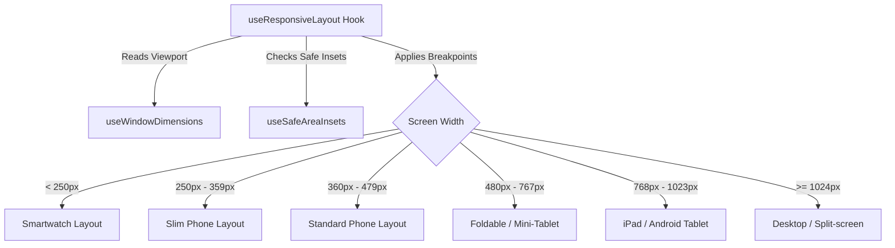

# Mobile Device Compatibility, Caching Fallback & Testing Guide (iOS & Android)

This comprehensive guide details the device compatibility, responsive screen layouts, background execution, gesture physics, offline caching fallbacks, and manual verification procedures for the **Viral Fabrics Mobile App** (React Native / Expo) across both **iOS** and **Android** platforms.

---

## Part 1: Universal Mobile Display & Device Support

The application is engineered to be fully responsive and stable across all mobile form factors, from slim budget phones to foldables, tablets, and desktop-mode docks.



### A. Breakpoints & Adaptive Grid System
Layout scaling, margin sizes, and column density are calculated dynamically in JavaScript using the [`useResponsiveLayout`](file:///home/krish/Downloads/ViralFabrics-main/mobile-app/hooks/useResponsiveLayout.ts) hook:

*   **Breakpoints Matrix:**
    *   `isSmartWatch`: Screen width `< 250px`
    *   `isSlimPhone`: Screen width `[250px, 360px)` (e.g. iPhone SE, compact Androids)
    *   `isPhone`: Screen width `[360px, 480px)` (Standard iPhones and Androids)
    *   `isFoldable`: Screen width `[480px, 768px)` (Samsung Galaxy Z Fold, Pixel Fold)
    *   `isTablet`: Screen width `[768px, 1024px)` (iPads, Lenovo/Galaxy Tablets)
    *   `isDesktop`: Screen width `>= 1024px` (iPads in full Split View, external docks)
*   **Adaptive Component Sizing:**
    *   **Modals:** `modalMaxWidth` is capped at `700px` on tablets/desktops to prevent content stretching, but expands to `100%` on phones.
    *   **Root Container:** Bounded at a maximum width of `1200px` on extra-large screens to keep text lines readable.

---

### B. Safe Area Management & Navigation Bars

To prevent content or buttons from clipping under hardware notches, camera cutouts, or system navigation bars, the layout dynamically computes safe area paddings using `useSafeAreaInsets()`.

```
+-----------------------------------------------------------+
| iOS Safe Area Guards       | Android Safe Area Guards     |
|----------------------------+------------------------------|
| * Copes with Notch/Dynamic | * Automatically detects      |
|   Island at the top.       |   Android 3-Button Navigation|
| * Bottom padding pushes    |   overlay (Back, Home,       |
|   buttons above the iOS    |   Recents) or gesture bar.   |
|   Home Indicator bar.      | * Margins adjust dynamically |
|                            |   so buttons never overlap   |
|                            |   system controls.           |
+-----------------------------------------------------------+
```

---

### C. Foldable Screen Support (3-State Layout)

Foldable devices (such as Samsung Galaxy Fold, Pixel Fold, and OnePlus Open) present three distinct screen ratios which the application handles seamlessly without requiring restarts or losing input data:

| Foldable State | Screen Type / Ratio | Behavioral Configuration |
| :--- | :--- | :--- |
| **1. Closed (Cover Screen)** | Narrow Phone (approx. `21:9`) | Swaps automatically to single column (`numColumns = 1`). Modals cover the full screen. Caret inputs scale down to narrow widths. |
| **2. Open (Horizontal)** | Landscape Tablet (approx. `4:3` or `16:10`) | Reflows to double/triple column view. Action buttons side-by-side. Modals are centered with a capped width of `700px` for premium readability. |
| **3. Open (Vertical / Flex Mode)** | Vertical Tablet (approx. `1:1` or `5:4`) | Adjusts content in a split aspect ratio. Inputs are placed in scrollable zones to prevent the virtual keyboard from covering fields. |

---

### D. Multitasking (Split View & Slide Over)
*   **On-the-fly Resize:** On iPads and Android Tablets, users can run the app side-by-side with other apps (Split View) or inside a floating panel (Slide Over).
*   **Fluid Adaptation:** The responsive grid dynamically shifts between tablet layouts (multi-column) and phone layouts (single-column) as the window is resized.

---

### E. 120Hz Displays & ProMotion Support
*   **iOS Support:** Unlocked by setting `"CADisableMinimumFrameDurationOnPhone": true` in `app.json`.
*   **Android Support:** Automatically matches native high refresh rate settings on compatible flagship phones.
*   **Scrolling Performance:** Utilizing `@shopify/flash-list` ensures list recycling matches the 120Hz refresh rate, keeping lists smooth.

---

## Part 2: Technical Architecture & Performance Enhancements

```
+------------------------------------------------------------------------------------------------+
|                                     VIRAL FABRICS APP INTERNALS                                |
|                                                                                                |
|  +---------------------------+  +---------------------------+  +----------------------------+  |
|  |     OFFLINE ENGINE        |  |    RENDERING PIPELINE     |  |       SECURITY LAYER       |  |
|  |  * Local caching (api.ts) |  |  * Modals (React.memo)    |  |  * Strict ADC credentials  |  |
|  |  * In-memory local filter |  |  * Callback isolation     |  |  * Sanitized parameters    |  |
|  |  * Stale check (7 days)   |  |  * Caret typing speedup   |  |  * Stable Cache Keys       |  |
|  +-------------+-------------+  +-------------+-------------+  +-------------+--------------+  |
+----------------|-----------------------------|-------------------------------|-----------------+
                 v                             v                               v
        AsyncStorage Database       Isolated Modal Components         Environment Isolation
```

### A. Offline Caching & In-Memory Fallback Filtering
To keep the app fast and robust, the application operates with an intelligent offline fallback architecture:

> [!TIP]
> **How Offline Local Filtering Works:**
> 1. When a network request fails (Wi-Fi disconnected), the Axios interceptor intercepts the call.
> 2. It checks for an exact cache match in `AsyncStorage`. If found, it serves it.
> 3. If there is a cache miss (e.g. the user changes the status filter to "delivered" while offline), the interceptor loads all cached lists matching that URL path, merges them, and filters them in-memory (using `status`, `type`, `search`, etc.).
> 4. It returns the mock response to React Query as a `200 OK` status, preventing any network error screen.

---

### B. Security & Data Leak Prevention
*   **Sanitized Cache Keys:** The cache key generator explicitly clones and strips the cache-busting millisecond timestamp `t` from query parameters (`delete sanitizedParams.t`). This prevents `AsyncStorage` from filling up with duplicate keys and leaking disk space.
*   **Environment Isolation:** Local caches are segregated per environment (Development vs. Staging vs. Production), preventing data leak cross-contamination when swapping environments.

---

### C. Isolated Component Rendering (Zero Typing Lag)
*   **Caret & Input Isolation:** Extracted modal sheets (`SelectOrderTypeModal`, `SelectPartyModal`, `SelectQualityModal`) into separate, memoized components.
*   **Internal Search States:** Modal search fields (`partySearch` and `qualitySearch`) live entirely inside the modal components.
*   **Result:** Typing in form fields or search boxes is instantaneous. The main screen layout does not re-render on keystrokes, completely eliminating keyboard typing lag and frame drops.

---

### D. Swipe-to-Close Sheet Physics
*   **Header Touch Interception:** Touches inside the top `85px` drag handle are intercepted immediately by returning `true` on `onStartShouldSetPanResponder` to distinguish sheet drags from inner content scrolls.
*   **Upward Resistance:** Dragging upward exerts a friction factor of `0.15` (e.g. `translateY = dragY * 0.15`), preventing the sheet from being dragged beyond its natural bounds.
*   **Dismissal Threshold:** Release gestures trigger a close animation if:
    1.  The downward drag exceeds `80px`.
    2.  The downward velocity (`vy`) is faster than `0.3 px/ms` (quick flick).
*   **Spring Restoring:** If the drag falls short of these thresholds, a customized spring animation (`tension: 40, friction: 9`) smoothly snaps the sheet back to the top.

---

### E. Background State Preservation
*   **State Detection:** Monitors system state changes using React Native's `AppState` API (`active` -> `background` -> `inactive`).
*   **Optimization:** When minimized, active WebSockets/subscriptions are temporarily suspended to reduce system battery drain, and immediately refetched via React Query when the application is woken up.

---

## Part 3: Step-by-Step Manual Verification & Test Cases

### Test Case 1: Spacing and Navigation Guard Verification
1. **On Android:** Go to System Settings -> Display -> Navigation Bar -> enable **3-Button Navigation**. Open the app.
2. **On iOS:** Open the app on an iPhone with a Notch/Dynamic Island.
3. Navigate to **Orders** -> Click **Filter** (or open status update modal).
4. **Verification:** The update buttons at the bottom of the modal must sit clearly above the navigation bar/home indicator with a comfortable touch margin. No parts should bleed underneath or be cut off.

### Test Case 2: Real-time Offline Filtering & Caching
1. While connected to Wi-Fi/data, load the **Orders** list page. Scroll down to populate the cache.
2. Turn off Wi-Fi/data (or enable Airplane Mode) on your device.
3. Change the status filter from **All** to **Pending** (or type a search term).
4. **Verification:** The list must filter the orders instantly. The app must **not** display a "Failed to Load / Network Error" screen, but instead serve filtered results from your local cache.

### Test Case 3: Create Order Form Response Speed
1. Go to **Orders** -> Click **Create Order** (`+`).
2. Open the **Party** select dropdown modal. Type in the search box.
3. **Verification:** The keyboard input must be smooth and lag-free.
4. Go back to the main form, and type in the **PO Number** and **Style Number** text fields.
5. **Verification:** The cursor must blink smoothly, and characters must appear instantly as you type without keyboard input stutter.

### Test Case 4: Foldable & Split-screen Layout Adaptation
1. Open the application on a foldable device or inside a split-screen layout.
2. Drag the split-screen handle to resize the app window.
3. **Verification:** The UI must automatically reflow. It should transition from tablet multi-column layout to a phone single-column layout instantly without crashing or reloading.

---

## Part 4: Cloud Device Testing (BrowserStack & Free Appetize.io Simulator)

### A. Free Cloud Testing (No Paid Apple Account Required)
If you do not have a paid Apple Developer Account, you can build for the **iOS Simulator** and test it online for free using **Appetize.io**:

1. **Trigger the Free iOS Simulator Build:**
   ```bash
   ./run-ios.sh --channel staging --simulator
   ```
   *This uses EAS cloud servers to compile a simulator-compatible package. Since it is for a simulator, **EAS will not prompt you for any Apple credentials or passwords**, making the build completely free and accessible.*

2. **Download and Locate the Build:**
   Once complete, the script automatically downloads the build and renames it to:
   * **`app-testing-simulator.tar.gz`** (if run on staging)
   * **`app-production-simulator.tar.gz`** (if run on production)

3. **Upload & Play on Appetize.io:**
   * Go to [Appetize.io](https://appetize.io/) (it has a generous free tier including 30 minutes/month of usage).
   * Upload the downloaded `.tar.gz` file.
   * Run the app directly inside your web browser simulator!

---

### B. Paid Real Device Testing (BrowserStack App Live & App Automate)
If you have a paid Apple Developer Account ($99/year), you can build a signed `.ipa` file and test it on physical iPhones on BrowserStack.

1. **Automatic Build & Upload:**
   Trigger the entire environment swap, EAS cloud build, download, and BrowserStack upload in a single command:
   ```bash
   ./run-ios.sh --channel staging --upload
   ```
   *This will copy `env.staging` to `.env`, start the cloud build, download the resulting `.ipa` as `app-testing.ipa`, and upload it directly to BrowserStack App Live.*

2. **Manual Upload Script:**
   If you already have a local `.ipa` file (e.g. `app-testing.ipa`), upload it using:
   ```bash
   ./upload-browserstack.sh app-testing.ipa
   ```

3. **Direct cURL command:**
   ```bash
   curl -u "YOUR_USERNAME:YOUR_ACCESS_KEY" \
     -X POST "https://api-cloud.browserstack.com/app-live/upload" \
     -F "file=@app-testing.ipa"
   ```

   **Response format:**
   ```json
   {
     "app_url": "bs://<hashed_app_id>",
     "shareable_id": "<shareable_identifier>"
   }
   ```


