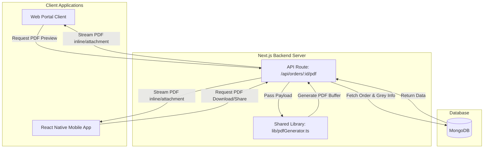

# Mobile PDF Integration & Sync Guide

This guide describes the optimal engineering method to ensure **100% identical and pixel-perfect PDF outputs** between the web portal and the mobile application in the ViralFabrics ecosystem.

---

## 1. The Best Method: Server-Side Single Source of Truth

To guarantee that the mobile application and the web portal generate the exact same PDF down to the last pixel—without any layout shift, font discrepancy, or data mismatch—the absolute best method is **Server-Side PDF Generation via a Shared API Endpoint**.

Rather than trying to replicate the complex `jsPDF` drawing code in React Native (which would require rewriting the entire 2,900 lines of drawing coordinates in a mobile-compatible library and maintaining two separate codebases), the mobile app delegates the PDF generation to the backend.



### Why This Method Guarantees 100% Accuracy:
1.  **Shared Codebase:** The backend API and the web frontend are part of the same Next.js workspace. They import the **exact same code file** ([pdfGenerator.ts](file:///home/krish/Downloads/ViralFabrics-main/lib/pdfGenerator.ts)). There is zero duplication or translation of layout logic.
2.  **Consistent Environment:** The PDF is compiled and drawn by the same V8 engine on the server, ensuring that font metrics, spacing, borders, and page breaks are identical regardless of whether the user is on an iPhone, Android, or desktop browser.
3.  **No Mobile Bloat:** The mobile app does not need to bundle heavy libraries like `jsPDF` or `jspdf-autotable`, reducing mobile bundle size and improving performance.
4.  **Automatic Synchronization:** Any updates, border corrections, or logo changes made to [pdfGenerator.ts](file:///home/krish/Downloads/ViralFabrics-main/lib/pdfGenerator.ts) are instantly live on **both** web and mobile. There is no need to release a new version of the mobile app to update the PDF layout!

---

## 2. Technical API Specification

The backend exposes a dedicated GET endpoint specifically designed to generate and stream the PO sheet PDF for a single item of an order:

*   **Endpoint:** `GET /api/orders/[id]/pdf`
*   **Authentication:** Requires either a standard session cookie or a JWT token passed in the query parameters (`token=...`) to allow external browser links to open securely.
*   **Parameters:**
    *   `id` (in URL): The MongoDB `_id` of the order.
    *   `itemIndex` (query param): The 0-indexed index of the quality item within the order (since PO sheets are generated per item/quality).
    *   `token` (query param): The JWT token for session-less authentication.

### API Header Contract:
```http
Content-Type: application/pdf
Content-Disposition: inline; filename="FABRIC_PURCHASE_ORDER_[orderId]_Item_[itemIndex].pdf"
Content-Length: [buffer_length]
```
The **`Content-Disposition: inline`** header is critical: it tells the receiving device to preview the PDF in a browser window or webview, rather than forcing a background download.

---

## 3. Mobile App Implementation Analysis

In the mobile app, when a user taps **Download** or **Share** on an order item, the app retrieves the API URL and opens it using the device's native handlers.

### A. Opening / Downloading the PDF
The mobile app uses Expo's `Linking` library to open the server-side PDF URL in the system's default web browser, where it renders inline with native print, save, and zoom features:

```typescript
// From mobile-app/app/(tabs)/orders.tsx
const handleDownloadPDF = async (order: Order, itemIndex: number) => {
  try {
    const token = await storage.getToken();
    const baseUrl = CONFIG.API_URL.endsWith('/') ? CONFIG.API_URL.slice(0, -1) : CONFIG.API_URL;
    
    // 1. Construct the exact same URL that the server expects
    const pdfUrl = `${baseUrl}/api/orders/${order._id}/pdf?itemIndex=${itemIndex}${token ? `&token=${token}` : ''}`;

    if (Platform.OS !== 'web') {
      Haptics.notificationAsync(Haptics.NotificationFeedbackType.Success);
    }

    // 2. Open the URL in the system browser
    await Linking.openURL(pdfUrl);

    addToast({
      type: 'success',
      title: 'Opening PDF 📄',
      message: 'Opening PDF document in browser.',
    });
  } catch (err: any) {
    console.error('Failed to open PDF URL:', err);
    addToast({
      type: 'error',
      title: 'Error ❌',
      message: 'Failed to download PDF. Please try again.',
    });
  }
};
```

### B. Sharing the PDF Direct Link
To share the purchase order via WhatsApp, email, or other apps, the mobile app uses React Native's `Share` API to send the direct PDF link. Recipients can tap the link and immediately view the 100% accurate PDF rendered on the fly:

```typescript
// From mobile-app/app/(tabs)/orders.tsx
const handleSharePDF = async (order: Order, itemIndex: number) => {
  try {
    const token = await storage.getToken();
    const baseUrl = CONFIG.API_URL.endsWith('/') ? CONFIG.API_URL.slice(0, -1) : CONFIG.API_URL;
    const pdfUrl = `${baseUrl}/api/orders/${order._id}/pdf?itemIndex=${itemIndex}${token ? `&token=${token}` : ''}`;

    // Share the direct live PDF link
    await Share.share({
      url: pdfUrl,
      message: `Fabric Purchase Order for ${order.orderId}: ${pdfUrl}`,
    });
  } catch (err: any) {
    console.error('Failed to share PDF:', err);
  }
};
```

---

## 4. Best Practices for Maintenance & Visual Synchronization

To keep this system working flawlessly without any drift between the two clients, adhere to the following guidelines:

1.  **Keep Layout Logic in `pdfGenerator.ts`:**
    Never write client-specific PDF drawing code. If you need to make changes to borders, text sizes, colors, or table heights, make them **exclusively** in [lib/pdfGenerator.ts](file:///home/krish/Downloads/ViralFabrics-main/lib/pdfGenerator.ts). This file is shared between the web client and the server API.
2.  **Maintain Consistent Payloads:**
    Ensure that the payload constructed on the client-side (for web downloads) and the payload constructed on the server-side (for API downloads) are identical. Both must supply the same populated sub-documents:
    *   `party` (with `name`)
    *   `items` (array containing the target item with populated `quality`)
    *   `greyInformation` (filtered for the active quality)
    *   `millInputs` (with populated mills and qualities)
    *   `millOutputs`
    *   `dispatches`
3.  **Verify Synchronization:**
    To verify that both methods yield binary-identical files:
    *   Generate a PDF via the Web Portal client-side button and save it.
    *   Generate a PDF via the Server API route for the same order and item and save it.
    *   Run a checksum comparison in your terminal:
        ```bash
        md5sum web_po.pdf api_po.pdf
        ```
        If the checksums match, the PDFs are 100% digitally identical.

---

## Summary of the Integration Strategy

| Component | Role | Technology | Benefit |
| :--- | :--- | :--- | :--- |
| **Shared Generator** | Defines PDF styling and layout | `jsPDF` | Single codebase for drawing; changes affect all platforms. |
| **Server-Side Endpoint** | Compiles data & streams PDF | Next.js API Routes | Eliminates PDF rendering engine discrepancies. |
| **Web Portal Client** | Client-side immediate trigger | React / Next.js | Instant generation without server load (or can use API route for unified experience). |
| **Mobile App Client** | Requests and shares server URL | React Native / Expo | Lightweight mobile bundle; no drawing libraries needed. |
