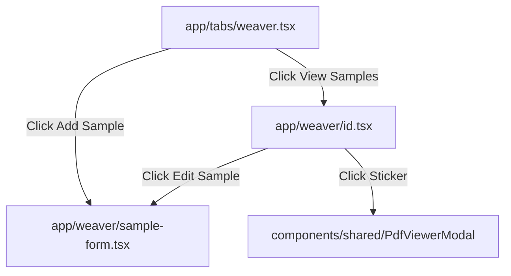

# Weaver with Sampling: Mobile Implementation Guide

This technical guide outlines the implementation of the **Weaver & Sampling** module within the React Native / Expo mobile application. It details how the web application works, key files, and how to replicate it on mobile using the project's design guidelines, caching architectures, and interactive flows.

---

## 1. Web Weaver Module: System Architecture

The web weaver module is divided into two primary features:
1. **Weavers Directory**: A directory of fabric weavers/manufacturers (their contact details and locations).
2. **Quality Sampling**: Fabric quality specifications (spec sheets) mapped to weavers, including width, weight, GSM, reed/pick densities, rates, and multi-image galleries.

### Key Files in Web Repository
- **[`types/index.ts`](file:///home/krish/Downloads/ViralFabrics-main/app/(pages)/(dashboard)/weaver/types/index.ts)**: Interfaces for `Weaver`, `Sample`, and `PaginationInfo`.
- **[`page.tsx`](file:///home/krish/Downloads/ViralFabrics-main/app/(pages)/(dashboard)/weaver/page.tsx)**: Main dashboard page listing weavers, handling filtering, and pagination.
- **[`view/[weaverId]/page.tsx`](file:///home/krish/Downloads/ViralFabrics-main/app/(pages)/(dashboard)/weaver/view/[weaverId]/page.tsx)**: Weaver detail page that displays a list of past samples.
- **[`components/SampleForm.tsx`](file:///home/krish/Downloads/ViralFabrics-main/app/(pages)/(dashboard)/weaver/components/SampleForm.tsx)**: Forms for adding and editing samples, including file inputs and drag-and-drop file/camera features.
- **[`components/WeaverModal.tsx`](file:///home/krish/Downloads/ViralFabrics-main/app/(pages)/(dashboard)/weaver/components/WeaverModal.tsx)**: Modal to create/edit weavers.
- **[`lib/pdfGenerator.ts`](file:///home/krish/Downloads/ViralFabrics-main/lib/pdfGenerator.ts)**: PDF sticker generator code.

### Web Database Schema & Attributes
A **Sample** matches a **Weaver** (via `weaverId`) and contains these properties:
- `qualityName` (String, required): Descriptive quality identifier.
- `type` (String, optional): Category (e.g. Polyester, Blend, Viscose, Cotton, Rayon, Other).
- `rack` (String, optional): Physical warehouse shelf/location.
- `greighWidth` / `finishWidth` (Number, optional): Width before/after processing.
- `weight` (Number, optional): Weight of sample in kilograms.
- `gsm` (Number, optional): Grams per square meter.
- `content` (String, optional): Fiber details (e.g., "100% Polyester").
- `danier` (String, optional): Yarn thickness.
- `count` (Number, optional): Thread count.
- `reed` / `pick` (Number, optional): Warp/weft weave densities.
- `greighRate` (Number, optional): Price/rate per meter.
- `note` (String, optional): Additional text/remarks.
- `images` (Array of Strings, URLs): Uploaded image URLs.

---

## 2. Mobile Architecture & Design Patterns

To deliver a premium, performant mobile experience on Android and iOS, the mobile screen must integrate with the existing services structure using TanStack React Query, NativeWind tailwind configurations, and Expo native integrations.

### Navigation and Routing
Using **Expo Router**, create the following structure:
- **`app/(tabs)/weaver.tsx`**: Weavers list tab with infinite scroll, search queries, sorting, and action buttons.
- **`app/weaver/[id].tsx`**: Detail view for a specific weaver, displaying their contact profile, summaries, and a grid listing of **Past Samples**.
- **`app/weaver/sample-form.tsx`**: Modal route for adding/editing samples.



---

## 3. Core Mobile Guidelines & UX Design

### A. Android 3-Button & Gestures Compliance
- **Physical Back Button**: Use the React Native `BackHandler` API to dismiss active sheets, custom camera views, and forms before allowing the user to exit the screen.
- **Touch Targets**: All action buttons must meet a minimum size of **44 × 44 dp** to ensure tap readability.
- **Close Options**: Modals should feature a clean header closing button (`X` icon) and support swipe-down-to-dismiss actions using `PanResponder` or Reanimated sheets.

### B. Image Picking & Camera Approvals
1. **Permissions Flow**:
   - Check and request permissions sequentially before triggering the hardware camera or image gallery:
     ```typescript
     const { status: cameraStatus } = await Camera.requestCameraPermissionsAsync();
     const { status: galleryStatus } = await ImagePicker.requestMediaLibraryPermissionsAsync();
     ```
2. **Multi-Image Selection**: Use `expo-image-picker` with `allowsMultipleSelection: true` to let users pick multiple gallery photos in one action.
3. **Local Compression Rules**:
   - Heavy raw camera photos slow down transfers and increase AWS costs.
   - Use `expo-image-manipulator` to compress image assets before uploading:
     ```typescript
     const compressed = await ImageManipulator.manipulateAsync(
       localUri,
       [{ resize: { width: 1920 } }], // Scale down maximum dimension
       { compress: 0.8, format: ImageManipulator.SaveFormat.JPEG }
     );
     ```

### C. Sticker Rendering & PDF Printing
- To print or share a sample label sticker, query the `/api/fabric-stickers` endpoint.
- Pass parameters (`qualityName`, `weaverName`, `width`, `gsm`, `content`, `count`, `rxP`, `danier`, `rack`, and user auth `token`) as query parameters.
- Open the sticker PDF inside the prebuilt [`PdfViewerModal`](file:///home/krish/Downloads/ViralFabrics-main/mobile-app/components/shared/PdfViewerModal.tsx).
- This modal automatically renders PDFs inline on iOS/Android via a WebView, caching downloads, and exposing share/save actions.

### D. Spec Sheet Table Grid (Visual Presentation)
On the weaver details screen, render each sample specification card with a clean, color-coded specifications grid similar to the web's fabric cards:

| Spec Field | Label Code | Highlight Color (Light/Dark Mode) |
| :--- | :--- | :--- |
| **GSM** | GSM | Pink (`#db2777`) |
| **Greigh Width** | Greigh W. | Green (`#059669` / `#34d399`) |
| **Finish Width** | Finish W. | Teal (`#0d9488` / `#2dd4bf`) |
| **Weight** | Weight | Amber (`#d97706` / `#fbbf24`) |
| **Count / Danier** | Count/Dan | Yellow (`#ca8a04` / `#facc15`) |
| **Reed / Pick** | Reed/Pick | Sky Blue (`#0284c7` / `#38bdf8`) |
| **Weaver Quality** | WQ Name | Purple (`#7c3aed` / `#c084fc`) |
| **Content** | Content | Indigo (`#4f46e5` / `#818cf8`) |
| **Rack Location** | Rack | Cyan (`#0891b2` / `#22d3ee`) |

---

## 4. Caching, Animations & Performance Rules

### A. TanStack React Query Configuration
Manage the list of weavers and samples using `useInfiniteQuery`.
- **Query Keys**: 
  - Weavers list: `['weavers', searchQuery, sortOrder]`
  - Weaver samples: `['samples', weaverId]`
- **Pagination**: Implement `onEndReached` on your `FlatList` pointing to `fetchNextPage()`, triggering only when `hasNextPage` is true and `isFetchingNextPage` is false.
- **Query Invalidation**: After adding, editing, or deleting a weaver or sample, invalidate the queries to trigger silent background refreshes:
  ```typescript
  queryClient.invalidateQueries({ queryKey: ['weavers'] });
  queryClient.invalidateQueries({ queryKey: ['samples', weaverId] });
  ```

### B. Image Performance & Caching
- **Avoid Default `<Image>`**: React Native's default image component lacks cache persistence.
- **Use `expo-image`**: Render all fabric and sample photos using the `expo-image` library:
  ```tsx
  import { Image } from 'expo-image';
  
  <Image
    source={{ uri: resolveImageUrl(imagePath) }}
    placeholder={require('../../assets/placeholder.png')}
    contentFit="cover"
    transition={200} // Smooth cross-fade transition
    cachePolicy="disk" // Persist images on user disk
  />
  ```

### C. Optimistic Updates (Instant Action UI)
- To create a fast UX, show additions or modifications in the list immediately using a generated client-side ID (`temp-sample-XYZ`).
- Run the API request/image upload in the background.
- If the background sync fails, roll back the state of the list to the cached database and display a warning toast to the user.

### D. Animations (Reanimated v3)
- Animate entering list cards using Reanimated's `FadeInDown` or `SlideInLeft` layouts:
  ```tsx
  import Animated, { FadeInDown } from 'react-native-reanimated';
  
  <Animated.View entering={FadeInDown.duration(300).delay(index * 50)}>
    <WeaverCard data={item} />
  </Animated.View>
  ```
- Trigger subtle haptic vibrations (`Haptics.impactAsync(Haptics.ImpactFeedbackStyle.Light)`) when buttons are clicked, or forms successfully save.

---

## 5. Mobile Code Blueprints & Templates

Here are the code blueprints for the three core components.

### Blueprint 1: Weavers Directory screen (`app/(tabs)/weaver.tsx`)
```tsx
import React, { useState, useCallback } from 'react';
import { View, Text, FlatList, TextInput, TouchableOpacity, RefreshControl } from 'react-native';
import { useSafeAreaInsets } from 'react-native-safe-area-context';
import { useInfiniteQuery, useQueryClient } from '@tanstack/react-query';
import { Search, Plus, SlidersHorizontal, ArrowUpDown } from 'lucide-react-native';
import * as Haptics from 'expo-haptics';
import { useRouter } from 'expo-router';

import api from '../../services/api';
import Card from '../../components/ui/Card';
import { useTheme } from '../../hooks/useTheme';
import { Colors } from '../../constants/colors';
import Animated, { FadeInDown } from 'react-native-reanimated';

const PAGE_SIZE = 10;

export default function WeaversScreen() {
  const { theme, isDarkMode } = useTheme();
  const insets = useSafeAreaInsets();
  const router = useRouter();
  
  const [search, setSearch] = useState('');
  const [debouncedSearch, setDebouncedSearch] = useState('');
  const [sortOrder, setSortOrder] = useState<'desc' | 'asc'>('desc');

  const queryClient = useQueryClient();

  const weaversQuery = useInfiniteQuery({
    queryKey: ['weavers', debouncedSearch, sortOrder],
    initialPageParam: 1,
    queryFn: async ({ pageParam = 1 }) => {
      const params = { page: pageParam, limit: PAGE_SIZE, sort: sortOrder === 'desc' ? 'newest' : 'oldest', search: debouncedSearch };
      const { data } = await api.get('/api/weaver/weavers', { params });
      const items = data?.data || [];
      return {
        items,
        hasNext: data?.pagination?.hasNextPage || items.length >= PAGE_SIZE,
        nextPage: pageParam + 1,
      };
    },
    getNextPageParam: (lastPage) => lastPage.hasNext ? lastPage.nextPage : undefined,
  });

  const weavers = weaversQuery.data?.pages.flatMap(p => p.items) || [];

  const handleSearch = (text: string) => {
    setSearch(text);
    // Simple debounce logic
    setTimeout(() => setDebouncedSearch(text), 400);
  };

  const loadMore = () => {
    if (weaversQuery.hasNextPage && !weaversQuery.isFetchingNextPage) {
      weaversQuery.fetchNextPage();
    }
  };

  return (
    <View style={{ flex: 1, backgroundColor: theme.background, paddingTop: insets.top }}>
      {/* Header & Search */}
      <View style={{ paddingHorizontal: 16, paddingVertical: 12 }}>
        <Text style={{ fontSize: 24, fontWeight: '800', color: theme.text }}>Weavers Directory</Text>
        <View style={{ flexDirection: 'row', alignItems: 'center', marginTop: 12, gap: 8 }}>
          <View style={{ flex: 1, flexDirection: 'row', alignItems: 'center', backgroundColor: isDarkMode ? '#1e293b' : '#f1f5f9', borderRadius: 12, paddingHorizontal: 12, height: 44 }}>
            <Search size={18} color={theme.textSecondary} />
            <TextInput
              value={search}
              onChangeText={handleSearch}
              placeholder="Search weavers..."
              placeholderTextColor={theme.textTertiary}
              style={{ flex: 1, marginLeft: 8, color: theme.text, fontSize: 15 }}
            />
          </View>
          <TouchableOpacity 
            onPress={() => {
              Haptics.impactAsync(Haptics.ImpactFeedbackStyle.Light);
              setSortOrder(prev => prev === 'desc' ? 'asc' : 'desc');
            }}
            style={{ width: 44, height: 44, borderRadius: 12, backgroundColor: isDarkMode ? '#1e293b' : '#f1f5f9', alignItems: 'center', justifyAlignment: 'center' }}
          >
            <ArrowUpDown size={20} color={theme.textSecondary} />
          </TouchableOpacity>
        </View>
      </View>

      {/* FlatList of Weavers */}
      <FlatList
        data={weavers}
        keyExtractor={(item) => item._id}
        onEndReached={loadMore}
        onEndReachedThreshold={0.4}
        refreshControl={
          <RefreshControl
            refreshing={weaversQuery.isRefetching}
            onRefresh={() => weaversQuery.refetch()}
            tintColor={Colors.primary[500]}
          />
        }
        renderItem={({ item, index }) => (
          <Animated.View entering={FadeInDown.duration(300).delay(index * 40)}>
            <Card style={{ marginHorizontal: 16, marginBottom: 12, padding: 16, borderColor: theme.borderLight }}>
              <Text style={{ fontSize: 18, fontWeight: '700', color: theme.text }}>{item.name}</Text>
              {item.phone && <Text style={{ color: theme.textSecondary, marginTop: 4 }}>📞 {item.phone}</Text>}
              {item.address && <Text style={{ color: theme.textTertiary, marginTop: 2 }} numberOfLines={2}>📍 {item.address}</Text>}
              
              <View style={{ flexDirection: 'row', justifyContent: 'flex-end', marginTop: 12, gap: 8 }}>
                <TouchableOpacity
                  onPress={() => {
                    Haptics.impactAsync(Haptics.ImpactFeedbackStyle.Light);
                    router.push(`/weaver/${item._id}`);
                  }}
                  style={{ paddingVertical: 8, paddingHorizontal: 14, borderRadius: 8, backgroundColor: isDarkMode ? 'rgba(99,102,241,0.15)' : '#e0e7ff' }}
                >
                  <Text style={{ color: Colors.primary[600], fontWeight: '700' }}>View Samples</Text>
                </TouchableOpacity>
              </View>
            </Card>
          </Animated.View>
        )}
      />
      
      {/* Floating Action Button */}
      <TouchableOpacity
        onPress={() => router.push('/weaver/sample-form')}
        style={{ position: 'absolute', right: 20, bottom: 20, backgroundColor: Colors.primary[600], width: 56, height: 56, borderRadius: 28, alignItems: 'center', justifyContent: 'center', shadowColor: '#000', shadowOpacity: 0.3, shadowRadius: 8, elevation: 6 }}
      >
        <Plus size={24} color="#fff" />
      </TouchableOpacity>
    </View>
  );
}
```

### Blueprint 2: Weaver detail & past samples screen (`app/weaver/[id].tsx`)
```tsx
import React, { useState } from 'react';
import { View, Text, FlatList, TouchableOpacity, Alert } from 'react-native';
import { useLocalSearchParams, useRouter } from 'expo-router';
import { useQuery, useMutation, useQueryClient } from '@tanstack/react-query';
import { ArrowLeft, Tag, FileText, Plus, Trash2 } from 'lucide-react-native';
import { Image } from 'expo-image';
import * as Haptics from 'expo-haptics';

import api from '../../services/api';
import { useTheme } from '../../hooks/useTheme';
import { Colors } from '../../constants/colors';
import PdfViewerModal from '../../components/shared/PdfViewerModal';
import { resolveImageUrl } from '../../utils/helpers';

export default function WeaverDetailsScreen() {
  const { id } = useLocalSearchParams();
  const { theme, isDarkMode } = useTheme();
  const router = useRouter();
  const queryClient = useQueryClient();

  const [pdfVisible, setPdfVisible] = useState(false);
  const [pdfUrl, setPdfUrl] = useState('');
  const [pdfTitle, setPdfTitle] = useState('');

  // Fetch Weaver Details
  const weaverQuery = useQuery({
    queryKey: ['weaver', id],
    queryFn: async () => {
      const { data } = await api.get(`/api/weaver/weavers/${id}`);
      return data?.data;
    }
  });

  // Fetch Samples List
  const samplesQuery = useQuery({
    queryKey: ['samples', id],
    queryFn: async () => {
      const { data } = await api.get(`/api/weaver/samples?weaverId=${id}`);
      return data?.data || [];
    }
  });

  const printSticker = async (sample: any) => {
    Haptics.impactAsync(Haptics.ImpactFeedbackStyle.Medium);
    const token = await api.defaults.headers.common['Authorization'];
    const rxPVal = sample.reed && sample.pick ? `${sample.reed}/${sample.pick}` : '';
    
    const params = new URLSearchParams({
      qualityName: sample.qualityName,
      weaverName: weaverQuery.data?.name || '',
      width: String(sample.finishWidth || ''),
      gsm: String(sample.gsm || ''),
      content: sample.content || '',
      count: String(sample.count || ''),
      rxP: rxPVal,
      danier: sample.danier || '',
      rack: sample.rack || ''
    });

    setPdfUrl(`${api.defaults.baseURL}/api/fabric-stickers?${params.toString()}`);
    setPdfTitle(`Sticker - ${sample.qualityName}`);
    setPdfVisible(true);
  };

  const gridCell = (label: string, value: string, color: string) => (
    <View style={{ flex: 1, padding: 6, borderRightWidth: 0.5, borderColor: isDarkMode ? '#334155' : '#cbd5e1' }}>
      <Text style={{ fontSize: 9, fontWeight: '700', color: theme.textSecondary, textTransform: 'uppercase' }}>{label}</Text>
      <Text style={{ fontSize: 12, fontWeight: '800', color: color, marginTop: 2 }}>{value}</Text>
    </View>
  );

  return (
    <View style={{ flex: 1, backgroundColor: theme.background }}>
      {/* Custom Header */}
      <View style={{ flexDirection: 'row', alignItems: 'center', padding: 16, borderBottomWidth: 1, borderColor: theme.borderLight }}>
        <TouchableOpacity onPress={() => router.back()} style={{ padding: 8 }}>
          <ArrowLeft size={20} color={theme.text} />
        </TouchableOpacity>
        <Text style={{ fontSize: 18, fontWeight: '800', color: theme.text, marginLeft: 8 }}>Weaver Profile</Text>
      </View>

      <FlatList
        data={samplesQuery.data}
        keyExtractor={(item) => item._id}
        ListHeaderComponent={
          <View style={{ padding: 16, backgroundColor: isDarkMode ? '#1e293b' : '#f8fafc', marginBottom: 12 }}>
            <Text style={{ fontSize: 22, fontWeight: '800', color: theme.text }}>{weaverQuery.data?.name}</Text>
            <Text style={{ color: theme.textSecondary, marginTop: 4 }}>📱 {weaverQuery.data?.phone || 'No Phone'}</Text>
            <Text style={{ color: theme.textSecondary, marginTop: 2 }}>📍 {weaverQuery.data?.address || 'No Address'}</Text>
          </View>
        }
        renderItem={({ item }) => (
          <View style={{ marginHorizontal: 16, marginBottom: 16, backgroundColor: theme.card, borderRadius: 12, borderWidth: 1, borderColor: theme.borderLight, overflow: 'hidden' }}>
            {item.images?.length > 0 && (
              <Image
                source={{ uri: resolveImageUrl(item.images[0]) }}
                style={{ width: '100%', height: 180 }}
                contentFit="cover"
                transition={200}
              />
            )}
            <View style={{ padding: 12 }}>
              <View style={{ flexDirection: 'row', justifyContent: 'space-between', alignItems: 'center' }}>
                <Text style={{ fontSize: 16, fontWeight: '800', color: theme.text }}>{item.qualityName}</Text>
                <Text style={{ fontSize: 14, fontWeight: '900', color: '#059669' }}>₹{item.greighRate}</Text>
              </View>

              {/* Data Specifications Grid Table */}
              <View style={{ borderWidth: 1, borderColor: theme.borderLight, borderRadius: 8, overflow: 'hidden', marginTop: 10 }}>
                <View style={{ flexDirection: 'row', borderBottomWidth: 0.5, borderColor: theme.borderLight }}>
                  {gridCell("GSM", String(item.gsm || '-'), '#db2777')}
                  {gridCell("Greigh W.", item.greighWidth ? `${item.greighWidth}"` : '-', '#059669')}
                  {gridCell("Finish W.", item.finishWidth ? `${item.finishWidth}"` : '-', '#0d9488')}
                </View>
                <View style={{ flexDirection: 'row' }}>
                  {gridCell("Content", item.content || '-', '#4f46e5')}
                  {gridCell("Reed/Pick", item.reed && item.pick ? `${item.reed}/${item.pick}` : '-', '#0284c7')}
                  {gridCell("Rack", item.rack || '-', '#0891b2')}
                </View>
              </View>

              {/* Actions */}
              <View style={{ flexDirection: 'row', justifyContent: 'flex-end', marginTop: 12, gap: 8 }}>
                <TouchableOpacity onPress={() => printSticker(item)} style={{ padding: 8, borderRadius: 8, backgroundColor: isDarkMode ? '#334155' : '#f1f5f9' }}>
                  <Tag size={16} color={Colors.primary[600]} />
                </TouchableOpacity>
              </View>
            </View>
          </View>
        )}
      />

      <PdfViewerModal
        visible={pdfVisible}
        pdfUrl={pdfUrl}
        title={pdfTitle}
        filename="fabric_sticker.pdf"
        onClose={() => setPdfVisible(false)}
      />
    </View>
  );
}
```

### Blueprint 3: Multiple Images Picker & Camera Form Modal (`components/WeaverSampleFormModal.tsx`)
```tsx
import React, { useState } from 'react';
import { View, Text, TextInput, TouchableOpacity, ScrollView, Alert, ActivityIndicator } from 'react-native';
import * as ImagePicker from 'expo-image-picker';
import { Camera } from 'expo-camera';
import * as ImageManipulator from 'expo-image-manipulator';
import { Plus, X, Camera as CameraIcon, Image as ImageIcon } from 'lucide-react-native';

import { useTheme } from '../hooks/useTheme';
import { Colors } from '../constants/colors';
import { uploadSingleImage } from '../utils/helpers';
import api from '../services/api';

export default function WeaverSampleFormModal({ weaverId, onClose, onSuccess }: { weaverId: string, onClose: () => void, onSuccess: () => void }) {
  const { theme, isDarkMode } = theme = useTheme();
  const [qualityName, setQualityName] = useState('');
  const [gsm, setGsm] = useState('');
  const [finishWidth, setFinishWidth] = useState('');
  const [greighRate, setGreighRate] = useState('');
  const [images, setImages] = useState<string[]>([]);
  const [submitting, setSubmitting] = useState(false);

  // Gallery Picker
  const pickImages = async () => {
    const { status } = await ImagePicker.requestMediaLibraryPermissionsAsync();
    if (status !== 'granted') {
      Alert.alert('Permission Denied', 'Gallery access is required to upload samples');
      return;
    }

    const result = await ImagePicker.launchImageLibraryAsync({
      mediaTypes: ImagePicker.MediaTypeOptions.Images,
      quality: 0.8,
      allowsMultipleSelection: true,
    });

    if (!result.canceled && result.assets) {
      const uris = result.assets.map(asset => asset.uri);
      compressAndAdd(uris);
    }
  };

  // Camera Capture
  const takePhoto = async () => {
    const { status } = await ImagePicker.requestCameraPermissionsAsync();
    if (status !== 'granted') {
      Alert.alert('Permission Denied', 'Camera access is required to click sample photos');
      return;
    }

    const result = await ImagePicker.launchCameraAsync({
      quality: 0.8,
    });

    if (!result.canceled && result.assets) {
      compressAndAdd([result.assets[0].uri]);
    }
  };

  // Local Processing / Compression
  const compressAndAdd = async (uris: string[]) => {
    for (const uri of uris) {
      try {
        const manipResult = await ImageManipulator.manipulateAsync(
          uri,
          [{ resize: { width: 1200 } }],
          { compress: 0.7, format: ImageManipulator.SaveFormat.JPEG }
        );
        setImages(prev => [...prev, manipResult.uri]);
      } catch (err) {
        console.warn('Image processing failed:', err);
      }
    }
  };

  const removeImage = (index: number) => {
    setImages(prev => prev.filter((_, i) => i !== index));
  };

  const handleSubmit = async () => {
    if (!qualityName.trim()) {
      Alert.alert('Validation Error', 'Quality name is required');
      return;
    }
    setSubmitting(true);
    try {
      // Upload images in parallel
      const uploadPromises = images.map(uri => uploadSingleImage(uri, 'weaver-samples'));
      const uploadedUrls = await Promise.all(uploadPromises);

      const payload = {
        weaverId,
        qualityName,
        gsm: Number(gsm) || 0,
        finishWidth: Number(finishWidth) || 0,
        greighRate: Number(greighRate) || 0,
        images: uploadedUrls,
      };

      await api.post('/api/weaver/samples', payload);
      Alert.alert('Success', 'Sample saved successfully');
      onSuccess();
      onClose();
    } catch (err) {
      Alert.alert('Error', 'Failed to save sample');
    } finally {
      setSubmitting(false);
    }
  };

  return (
    <ScrollView style={{ flex: 1, backgroundColor: theme.background, padding: 16 }}>
      <Text style={{ fontSize: 20, fontWeight: '800', color: theme.text, marginBottom: 16 }}>New Fabric Sample</Text>
      
      <TextInput
        placeholder="Quality Name"
        value={qualityName}
        onChangeText={setQualityName}
        placeholderTextColor={theme.textTertiary}
        style={{ borderWidth: 1, borderColor: theme.borderLight, color: theme.text, padding: 12, borderRadius: 8, marginBottom: 12 }}
      />
      
      <TextInput
        placeholder="GSM"
        value={gsm}
        onChangeText={setGsm}
        keyboardType="numeric"
        placeholderTextColor={theme.textTertiary}
        style={{ borderWidth: 1, borderColor: theme.borderLight, color: theme.text, padding: 12, borderRadius: 8, marginBottom: 12 }}
      />

      <TextInput
        placeholder="Finish Width (inches)"
        value={finishWidth}
        onChangeText={setFinishWidth}
        keyboardType="numeric"
        placeholderTextColor={theme.textTertiary}
        style={{ borderWidth: 1, borderColor: theme.borderLight, color: theme.text, padding: 12, borderRadius: 8, marginBottom: 12 }}
      />

      <TextInput
        placeholder="Greigh Rate (₹)"
        value={greighRate}
        onChangeText={setGreighRate}
        keyboardType="numeric"
        placeholderTextColor={theme.textTertiary}
        style={{ borderWidth: 1, borderColor: theme.borderLight, color: theme.text, padding: 12, borderRadius: 8, marginBottom: 16 }}
      />

      {/* Image selector */}
      <Text style={{ fontWeight: '700', color: theme.text, marginBottom: 8 }}>Sample Images</Text>
      <View style={{ flexDirection: 'row', gap: 12, marginBottom: 16 }}>
        <TouchableOpacity onPress={pickImages} style={{ flex: 1, height: 48, borderStyle: 'dashed', borderWidth: 1.5, borderColor: theme.borderLight, borderRadius: 8, alignItems: 'center', justifyContent: 'center', flexDirection: 'row', gap: 6 }}>
          <ImageIcon size={18} color={theme.textSecondary} />
          <Text style={{ color: theme.textSecondary }}>Gallery</Text>
        </TouchableOpacity>
        <TouchableOpacity onPress={takePhoto} style={{ flex: 1, height: 48, borderStyle: 'dashed', borderWidth: 1.5, borderColor: theme.borderLight, borderRadius: 8, alignItems: 'center', justifyContent: 'center', flexDirection: 'row', gap: 6 }}>
          <CameraIcon size={18} color={theme.textSecondary} />
          <Text style={{ color: theme.textSecondary }}>Camera</Text>
        </TouchableOpacity>
      </View>

      {/* List of images */}
      <ScrollView horizontal style={{ flexDirection: 'row', gap: 8, marginBottom: 24 }}>
        {images.map((uri, index) => (
          <View key={index} style={{ width: 80, height: 80, borderRadius: 8, overflow: 'hidden', position: 'relative' }}>
            <Image source={{ uri }} style={{ width: '100%', height: '100%' }} />
            <TouchableOpacity onPress={() => removeImage(index)} style={{ position: 'absolute', top: 4, right: 4, backgroundColor: 'rgba(0,0,0,0.6)', borderRadius: 10, padding: 4 }}>
              <X size={12} color="#fff" />
            </TouchableOpacity>
          </View>
        ))}
      </ScrollView>

      {submitting ? (
        <ActivityIndicator size="large" color={Colors.primary[500]} />
      ) : (
        <View style={{ flexDirection: 'row', gap: 12 }}>
          <TouchableOpacity onPress={onClose} style={{ flex: 1, padding: 14, borderRadius: 8, backgroundColor: isDarkMode ? '#334155' : '#f1f5f9', alignItems: 'center' }}>
            <Text style={{ color: theme.textSecondary, fontWeight: '700' }}>Cancel</Text>
          </TouchableOpacity>
          <TouchableOpacity onPress={handleSubmit} style={{ flex: 1, padding: 14, borderRadius: 8, backgroundColor: Colors.primary[600], alignItems: 'center' }}>
            <Text style={{ color: '#fff', fontWeight: '700' }}>Save Sample</Text>
          </TouchableOpacity>
        </View>
      )}
    </ScrollView>
  );
}
```
